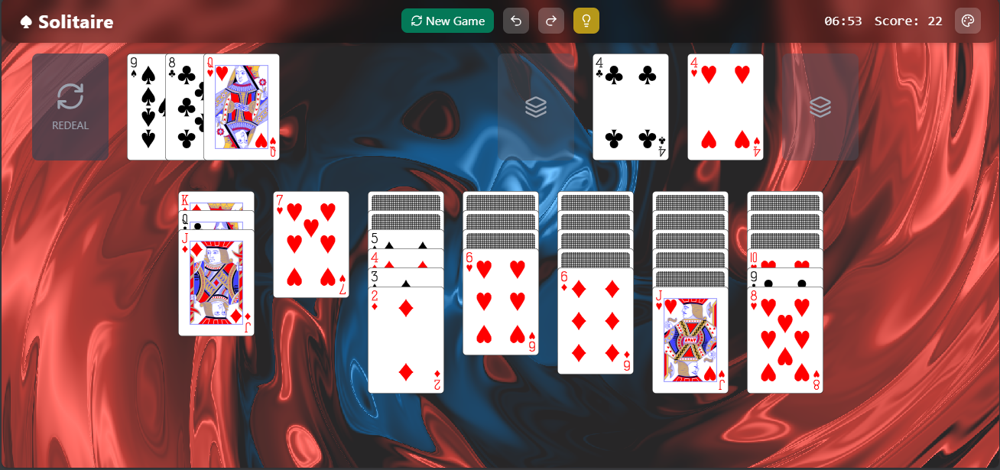
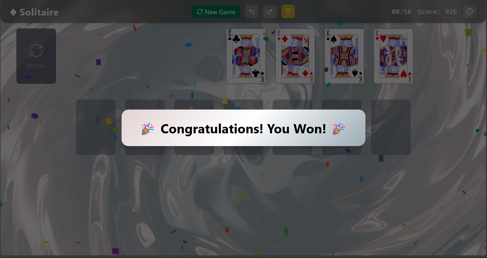
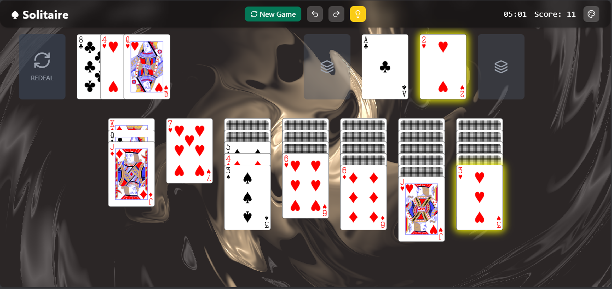
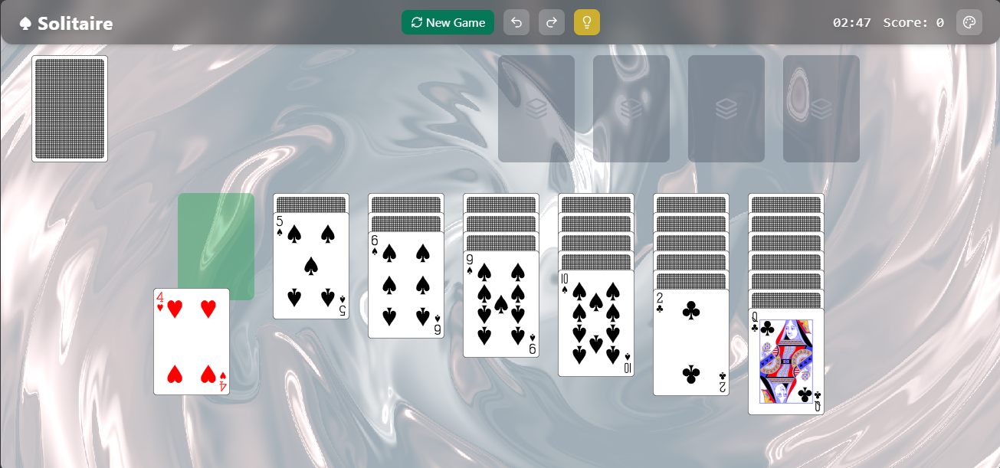

📘 Solitaire (Turn-Three) – DSA Project

A modern implementation of Klondike Solitaire (Turn-Three) built using React, featuring custom data structure implementations (Linked List, Stack, Queue), smooth animations, undo-redo support, hints, and a responsive UI.

Developed as part of the CSC200 – Data Structures & Algorithms mid-term project.

✅ Features

✔ Turn-Three solitaire gameplay
✔ Access to any of the top three waste cards
✔ Move multiple cards within tableau
✔ Custom data structures
 • Linked List — Tableau
 • Stack — Foundation & Undo/Redo
 • Queue — Stock
✔ Undo / Redo functionality
✔ Hint system
✔ Timer
✔ Smooth animations & effects
✔ Light / Dark / Bold themes
✔ Full win detection & victory celebration

🧠 Data Structures Used
Component	Structure	Reason
Tableau	Linked List	Efficient multi-card movement
Foundation	Stack	Only top card access
Stock	Queue	Draw FIFO order
Waste	Array	Access any top 3 cards
Undo / Redo	Stack	State traversal
🚀 Live Demo

🔗 Play here: [Launch Game](https://solitairegame.vercel.app/)

🛠️ Tech Stack

React

Vite

Tailwind CSS

Framer Motion

Lucide React

@heruka_urgyen/react-playing-cards

NPM

Custom DSA structures (Linked List, Stack, Queue)

📁 Project Structure
src/
 ├── components/
 │    ├── Balatro/
 │    ├── DraggableCard.jsx
 │    ├── DroppablePile.jsx
 │    ├── Header.jsx
 │    └── SolitaireBoard.jsx
 ├── dataStructures/
 │    ├── LinkedList.js
 │    ├── Stack.js
 │    └── Queue.js
 ├── game/
 │    ├── GameLogic.js
 │    └── Card.js/
 ├── main.jsx
 ├── index.css
 └── App.jsx

⚙️ Installation & Setup
🔹 Requirements

Node.js v16+

NPM v8+

Note: Due to peer dependency conflicts, this project uses
legacy-peer-deps=true
(handled via .npmrc)

🔹 Steps
# Clone repository
git clone [Repository Link](https://gitlab.com/aa727dar/csc200m24pid156.git)

# Navigate
cd CSC200M24PID156

# Install dependencies
npm install

# Start dev server
npm run dev

Open 👉 http://localhost:5173

🎮 How to Play

Tableau piles: Arrange alternating color & descending rank

Foundation: Build A → K (same suit)

Stock: Draw 3 cards to waste

Waste: You may choose any of top 3 cards

Move sequences within tableau allowed

Win when all cards reach foundation

♻️ Undo / Redo

Game state stored after valid moves

Undo → Restore from undo stack

Redo → Restore from redo stack

💡 Hint System

Highlights a valid next move when the player is stuck.

📸 Screenshots

✅ Testing

Move validation

Tableau ↔ Foundation rules

Waste top-3 selection

Undo/Redo correctness

Win detection

Hint suggestions

Stock recycle behavior

🏁 Results

✔ Fully playable
✔ Valid rules enforced
✔ Undo / redo functional
✔ Hint system in place
✔ Smooth user experience

🔮 Future Improvements

Auto-complete / auto-solve

Scoring system

Sound effects

Mobile support

Persistent storage (save game)

Additional hint levels

📚 References

https://solitaired.com
 – Gameplay reference

@heruka_urgyen/react-playing-cards

👤 Author

Name: Abdullah Amir
Course: CSC200 – Data Structures & Algorithms
Instructor: Nazeef-ul-Haq